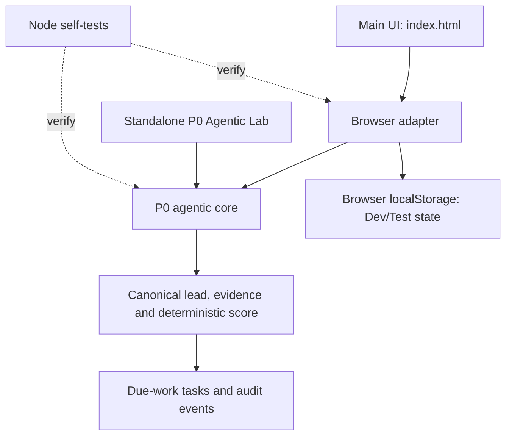

<div align="center">

# 🎯 JKDD Leads

### A lead intake and follow-up prototype for remodeling and construction businesses

**Capture → qualify → prioritize → review → follow up**

[](https://github.com/joukinneto/jkdd-leads/actions/workflows/ci.yml)
[](https://github.com/joukinneto/jkdd-leads/actions/workflows/pages.yml)


[Open the Dev/Test preview](https://joukinneto.github.io/jkdd-leads/) · [Open the P0 Agentic Lab](https://joukinneto.github.io/jkdd-leads/p0/demo.html) · [Read the current status](STATUS.md)

**English** · [Resumo em português](#resumo-em-português)

</div>

> **Current state:** an early Development/Test prototype. The P0 lead core, browser adapter and standalone lab are in the repository and automated checks passed. The application has no production backend, real authentication or verified live lead-source integration. **Production is untouched.**

**Last reviewed:** 2026-09-24 (UTC) · **Reviewed main SHA:** `bccd0f5`

## What it is

JKDD Leads is a lightweight lead intake and follow-up prototype for **JKDD Finish & Remodeling**, the designated first pilot. Its intended users are small remodeling and construction businesses that need a clearer way to capture prospects, understand what information supports a lead, prioritize follow-up and record human-reviewed actions.

The project is testing a focused workflow before expanding into a larger CRM. Its operating rule is:

> **One lead → one canonical record → multiple product views.**

JKDD Leads owns the lead record. CONTÍNUO remains the engineering orchestration layer. The repository registry classifies this product as independent and does not require the JKDD Foundation runtime.

## What is implemented

| Area | Present in the repository | Evidence and boundary |
| --- | --- | --- |
| Main web interface | Login/setup screen, dashboard, lead inbox, lead form, rule-based copilot, settings and a Voice Lab rehearsal | `index.html`. These screens have not received an independent browser/mobile smoke test in this review. |
| P0 lead core | Normalization and fingerprints, duplicate detection, field evidence, deterministic qualification, due-work tasks, lease semantics and append-only audit events | `p0/agentic-core.js` and `docs/P0_AGENTIC_LEAD_CORE.md`; covered by a Node self-test in CI. |
| Browser adapter | Connects the main interface to the P0 core and stores Dev/Test state in browser `localStorage` | `p0/browser-adapter.js`; adapter self-test covers intake, duplicate handling, a task lease and reload persistence with test storage. This is browser-local, not shared server storage. |
| P0 Agentic Lab | Separate form to try intake, evidence, scoring, queue actions and audit output with sample data | `p0/demo.html`. It is a Development/Test demonstration, not a production service. |
| GitHub Pages | A workflow validates and deploys the static repository from `main` | Latest successful deployment reviewed: [run 36035106783](https://github.com/joukinneto/jkdd-leads/actions/runs/36035106783), integrated SHA `bccd0f5`. This confirms deployment workflow success; it is not a user-journey or security certification. |

Qualification is a **pilot heuristic**, not a machine-learning result. The current copilot answers from local lead data with deterministic rules. The Voice Lab is a rehearsal surface; the current code says it does not place real calls.

## P0 flow and code layout

The diagram shows only relationships visible in the current source. External lead sources, server storage and live agent services are not connected in this flow.



## Run and test

No package installation is needed for the P0 self-tests. The tested commands are:

```bash
node p0/self-test.cjs
node p0/browser-adapter-self-test.cjs
```

Both commands are invoked by the repository's [Development/Test CI workflow](.github/workflows/ci.yml). During this documentation review, I verified the successful GitHub Actions run; I did not rerun these commands locally.

To serve the static interface from a local checkout, run a static file server from the repository root, for example:

```bash
python3 -m http.server 8000
```

Then open `http://localhost:8000`. Python is only an example static server; it is not an application dependency. A current minimum supported Node.js version is not declared in the repository.

## Current boundaries and open work

- **Client-side only:** login validates fields in the page and stores a local preview session; it is not real account authentication.
- **Local persistence only:** the browser adapter uses `localStorage`. Records are not shared across devices or users and are not a secure production data store.
- **No live lead channel verified:** a real website form, inbox, CRM or external intake source has not been demonstrated end to end.
- **No autonomous outreach:** contact actions are human-reviewed records; the project does not make real calls or send unsolicited messages.
- **No live AI provider verified:** the current copilot behavior is deterministic and local; an LLM connection is not present in the reviewed main flow.
- **Pilot evidence is pending:** no measured lead-to-contact, appointment, estimate, won-job or attributable-revenue dataset was found.
- **Server queue is pending:** the current queue models leases in local state; a transactional, shared worker claim is not implemented.
- **Production is not ready and remains untouched.**

See [STATUS.md](STATUS.md) for the audit evidence, open GitHub work, limitations and prioritized next steps. The P0 contract is in [docs/P0_AGENTIC_LEAD_CORE.md](docs/P0_AGENTIC_LEAD_CORE.md).

## Visual evidence

The repository contains an executable-style P0 lab but no committed application screenshots, GIFs or product banner. This README uses a source-backed Mermaid diagram instead of presenting a mockup as a real screen. Add screenshots after capturing the current deployed Development/Test interface and checking desktop and mobile behavior.

## Governance and contribution

Development/Test only. Production changes, real customer-data handling and live outreach require their own explicit product and security decisions. The repository has no verified license file, so no reuse or contribution license is stated here. See [AGENTS.md](AGENTS.md) before proposing changes.
 
## Resumo em português

O **JKDD Leads** é um protótipo Dev/Test para receber, organizar, qualificar e acompanhar leads de serviços de reforma e construção. O núcleo P0 e seu adaptador de navegador estão no repositório e passaram pelos testes automatizados do GitHub Actions. O estado atual fica no navegador; não há autenticação real, banco compartilhado nem integração de captação validada. A demonstração e a pontuação são limitadas ao ambiente de teste. A validação com o piloto e os próximos passos estão em [STATUS.md](STATUS.md). **Produção permanece intocada.**
