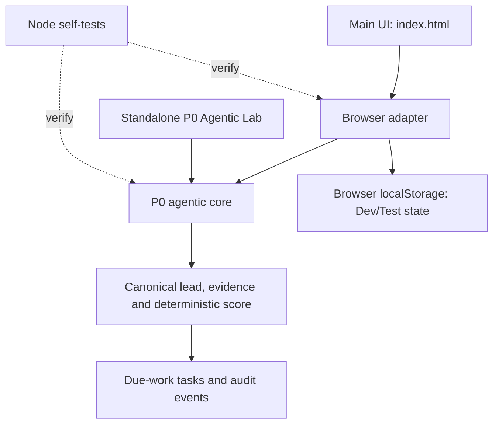

# JKDD Leads — Status and Audit

**Review date:** 2026-09-25 (UTC)  
**Repository:** [joukinneto/jkdd-leads](https://github.com/joukinneto/jkdd-leads)  
**Reviewed branch / commit:** `main` / `93dd50204e590387ccb1796d90c2f1acf5ec106d`  
**Environment:** Development/Test  
**Production:** Untouched

## Executive summary

JKDD Leads is an early static-web prototype with a useful, automated-tested P0 lead-processing slice. The P0 engine, browser adapter and standalone lab are implemented. PRs [#9](https://github.com/joukinneto/jkdd-leads/pull/9), [#10](https://github.com/joukinneto/jkdd-leads/pull/10), [#12](https://github.com/joukinneto/jkdd-leads/pull/12) and [#13](https://github.com/joukinneto/jkdd-leads/pull/13) are merged to `main`. The latest reviewed CI run [36073976076](https://github.com/joukinneto/jkdd-leads/actions/runs/36073976076) and Pages deployment [36074001435](https://github.com/joukinneto/jkdd-leads/actions/runs/36074001435) succeeded for main SHA `93dd502`. A synthetic browser pass of the isolated P0 lab also succeeded on 2026-09-25.

This is **not a complete or production-ready CRM**. The main interface uses browser-local state, the login is a client-side preview flow, and no live lead source, shared backend, real account authentication, real outreach or measured pilot outcome was verified. The first-pilot experiment [#7](https://github.com/joukinneto/jkdd-leads/issues/7) and technical P0 tracking issue [#8](https://github.com/joukinneto/jkdd-leads/issues/8) remain the outstanding validation tracks.

### Status criteria

- **Implemented:** relevant code exists in the reviewed main commit.
- **CI-validated:** an automated workflow passed the specific checks listed below.
- **Deployed:** the GitHub Pages workflow completed successfully for the integrated commit.
- **Pilot-validated:** actual pilot lead flow and outcome evidence exist. **Not met.**
- **Production-ready:** secure server-side identity/storage, data boundaries and runtime validation exist. **Not met.**

## Feature status

| Capability | Status | Evidence / limits |
| --- | --- | --- |
| Main UI and dedicated lead form | Implemented in source; authenticated flow not browser-validated | `index.html` and `new-lead.html`; navigation/form changes merged in PRs #12/#13. Local preview login is not real authentication. |
| P0 canonical lead intake and duplicate detection | Implemented; Node self-test passed in CI | `p0/agentic-core.js` fingerprints normalized email, phone or name/location and records duplicate events. |
| Evidence and deterministic qualification | Implemented; Node self-test passed in CI | Evidence carries a source and strength; score bands and reasons are deterministic. Scores are pilot heuristics, not ML predictions. |
| Due-work queue and recheck | Implemented in the local P0 engine; Node self-test passed in CI | Tests cover due-task claim, active-lease exclusion and completion by the lease owner. This is not a transactional shared server queue. |
| Browser adapter and persistence | Implemented; adapter self-test passed in CI | `p0/browser-adapter.js` serializes app state to browser `localStorage`. The CI self-test uses test storage; no real browser persistence or multi-device test was run here. |
| P0 Agentic Lab | Browser-tested with synthetic data on 2026-09-25 | `p0/demo.html`: intake, accepted evidence, deterministic qualification, duplicate rejection, reasoned follow-up, due task claim/completion and audit summary. Isolated in-memory demo only; no backend/auth/customer data. |
| GitHub Pages Dev/Test deployment | Deployed for reviewed main SHA | [Reviewed successful deployment](https://github.com/joukinneto/jkdd-leads/actions/runs/36074001435), main SHA `93dd502`. A successful deployment is not proof of a tested user journey. |
| Live lead form / inbox integration | Not verified / pending | No connected inbound source or end-to-end external lead was evidenced in the reviewed files, CI or open pilot issue. |
| Real authentication, shared database, multi-user operation | Not implemented in the reviewed main flow | The login/session flow is client-side and the P0 adapter stores state locally. |
| Automated customer calls or messages | Not implemented | Voice Lab is a rehearsal view; the code labels calls as manual and does not show a real call provider. |
| LLM / external AI copilot | Not verified; current copilot is deterministic | The reviewed UI answers selected/keyword prompts from local lead state. No live model integration was found in the main flow. |
| Pilot outcomes / commercial validation | Pending | No verified contact, appointment, estimate, won-job, attributable revenue or willingness-to-pay results were found. |

## Architecture observed

The central repository registry classifies `jkdd-leads` as an independent product with `foundation_required: false` and product-specific authentication. The CONTÍNUO global policy does not force the Foundation runtime into independent products. No Foundation runtime or authentication integration is claimed for this prototype; any shared Foundation capabilities adopted later remain subject to Foundation ownership.

## Verification actually performed

### GitHub Actions evidence

1. **Latest CI:** [run 36073976076](https://github.com/joukinneto/jkdd-leads/actions/runs/36073976076), reviewed as successful for current `main` SHA `93dd502`. Earlier P0 run [36035063384](https://github.com/joukinneto/jkdd-leads/actions/runs/36035063384) shows the configured P0 test commands, including:
   - `node p0/self-test.cjs`
   - `node p0/browser-adapter-self-test.cjs`
   - static checks for the app elements and the P0 script wiring.
2. **Pages deployment:** [run 36074001435](https://github.com/joukinneto/jkdd-leads/actions/runs/36074001435), main SHA `93dd502`, completed successfully.
3. **Earlier runs:** the history includes failures as well as successes; success of the latest runs does not imply the entire history is green.

### Scope of the validation

The Actions runs confirm configured static checks and Node self-tests passed, and the Pages deployment succeeded. In addition, the published P0 Agentic Lab was exercised manually with synthetic values on 2026-09-25. The browser pass observed one lead created, accepted evidence recorded, a deterministic HOT score for the fixture, a repeated contact rejected as duplicate, a reasoned follow-up scheduled, a due task claimed/completed, and audit events displayed. This confirms only that lab workflow in that browser session; it does **not** confirm:

- the authenticated main application flow or responsive desktop/mobile behavior (the preview showed its first-access form; no account was created);
- deployed main-app localStorage persistence across reloads;
- a connected production-like lead source or external CRM;
- real authentication, access control, privacy or tenant isolation;
- real WhatsApp/SMS/phone delivery;
- server-side concurrent queue claiming;
- end-to-end pilot or revenue outcomes.

I did not rerun the Node tests locally. The P0 lab browser pass used synthetic data and in-memory state; it did not test authentication, backend persistence, a second worker in the UI, external lead sources or real pilot outcomes.

## Repository and workflow snapshot

- **Default branch:** `main`; reviewed head `93dd502`.
- **Branches:** 9 listed at review; none reported as protected by the branches API. GitHub's repository page also showed the main-branch protection notice.
- **Issues:** 4 open issues were returned: [#1](https://github.com/joukinneto/jkdd-leads/issues/1), [#6](https://github.com/joukinneto/jkdd-leads/issues/6), [#7](https://github.com/joukinneto/jkdd-leads/issues/7), [#8](https://github.com/joukinneto/jkdd-leads/issues/8).
- **Pull requests:** #9, #10, #12 and #13 are merged. Other open PR state was not re-audited for this update.
- **Actions:** recent PR checks and the latest Pages deploy succeeded; older runs include failures. CI runs on pull requests and manual dispatch; Pages deploys on pushes to `main` and manual dispatch.
- **Releases / tags:** no published releases were visible in the reviewed GitHub repository page; the page showed zero tags.
- **License:** no `LICENSE` file and repository metadata returned no license. Do not imply an open-source reuse license.
- **Visual assets:** the recursive main tree contains no image, GIF or video assets. `p0/demo.html` is a real source demo, not a captured screenshot.
- **Scope observation:** `family-finance/index.html` is also present in this repository. The Pages workflow uploads the repository root, so that separate product page is included in the deployed artifact. It references `/jkdd-family-finance/flutter.js`, which is outside this repository; its intent and runtime were not verified in this audit.

## Risks, blockers and dependencies

1. **Local browser state is not a shared or protected data store.** Do not use the current prototype for sensitive real customer data or multi-user operations without an approved server-side identity/storage design.
2. **The pilot is blocked on evidence, not more UI.** Issue #7 defines a first-pilot experiment and economic validation; no outcome data is currently recorded.
3. **The current UI has no connected intake source.** A real/safely staged end-to-end lead needs a governed source, field provenance and duplicate checks.
4. **Queue leases are local only.** The P0 contract explicitly defers atomic claims in a transactional server database.
5. **External extraction remains only a PoC.** Issue #6 is open; no Scrapling adapter or extraction evidence appears in the current tree.
6. **Main has no branch protection.** Required checks and protection would reduce the chance of unreviewed changes entering the published Development/Test line.
7. **A separate Family Finance page is bundled into the Pages artifact.** Confirm whether this belongs in the Leads repository and verify its external asset path.
8. **License is unspecified.** Decide whether the repository is proprietary or will receive a license before inviting external reuse or contributions.

## Prioritized next steps

### P0 — Close the pilot learning loop

1. Update issue #8's acceptance checklist to reflect what PRs #9/#10 implemented and state the remaining technical tasks; keep it open until the real P0 Definition of Done is met.
2. Follow issue #7: start with a safely staged lead, record each conversion milestone and time-to-first-contact, then conduct the planned external pilot conversations. Keep engineering activity separate from measured customer outcomes.
3. Decide whether the Family Finance file belongs here; if retained, verify the linked asset and the effect of publishing it with the Leads site.

### P1 — Validate the Dev/Test user journey

4. Open the published preview on desktop and phone, test first access, lead entry, deduplication, task queue and reload behavior, and capture real screenshots for the README.
5. Connect the approved JKDD Finish lead-intake source in Development/Test and verify one end-to-end record before adding channels or enrichment.

### P2 — Prepare for multi-user use

6. Design and validate server-side authentication, access control, shared storage and atomic task claiming under the product's governance. Keep Production untouched.
7. Implement pilot metrics and connect CONTÍNUO only when issue #7 or #8 records a concrete need.
8. Complete the separate web-extraction PoC #6 with provenance, source policy, privacy review, measured cost and a go/no-go decision before adoption.

### P3 — Repository hygiene

9. Add branch protection / required CI checks, decide on a license, and resolve or close the two stale draft PRs after their owners review them.

## Evidence consulted

- Local repository instructions: [AGENTS.md](AGENTS.md); current README and P0 contract.
- Central JKDD Foundation governance: CONTÍNUO skill, Global Repository Policy and Repository Registry. Registry entry: `class: independent-product`, `foundation_required: false`, `auth_model: product-specific`.
- Source tree at reviewed main: `index.html`, `p0/agentic-core.js`, `p0/browser-adapter.js`, both P0 self-tests, `p0/demo.html`, and workflows `.github/workflows/ci.yml` and `.github/workflows/pages.yml`.
- GitHub branches, recent commits, Issues, PRs, repository metadata and Actions run/job summaries cited above.
- Review date: 2026-09-25 (UTC).
